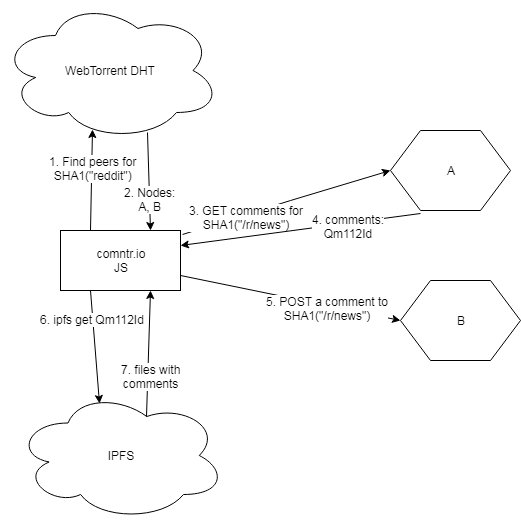

1. JS on `comntr.io` uses WebTorrent DHT to discover servers seeding `SHA1("reddit")`.
2. The DHT returns two servers: `A` and `B`.
3. `comntr.io` sends a `GET` to `A` asking to return comments for `SHA1("/r/news")`.
4. `A` returns an IPFS folder id with those comments: `Qm112Id`.
5. `comntr.io` sends a POST to `B` to add a new comment to `SHA1("/r/news")`.
6. `comntr.io` uses IPFS to download files in `Qm112Id`.
7. IPFS network discovers and returns the comments in `Qm112Id`.

#### How server `A` joins the network:

0. It needs to have a static IP address to act as a HTTP server. It doesn't need to have a domain name. It should be possible to have a dynamic IP address as long as it can accept incoming connections to act as a HTTP server. Then every time the IP or port changes, it can announce it to the DHT. If it's behind a symmetric NAT (most mobile networks ISPs), then it won't be able to accept incoming connections.
1. It starts a WebTorrent node and announces to the DHT that it's seeding `SHA1("reddit")`.
2. It starts a IPFS node to distribute folders with comments.
3. It starts a HTTP server that implements the following actions:
    - When it receives a `POST` that wants to add a comment to `SHA1("/r/news")`, it creates a folder with this hash and adds the comment in that folder.
    - When it receives a `GET` for `SHA1("/r/news")`, it finds this folder, uses `ipfs add` to publish files in the folder to the IPFS network and returns the IPFS folder id.
    - `GET` with no path, e.g. `GET /`, returns IPFS folder id for all the topics it knows: `SHA1("/r/news")`, `SHA1("/r/gifs")`, etc. This is useful to replicate data to other servers.

The folder structure looks like this:

```
/27aa67d11878da3049675f218f9822318d27bf67 # sha1("reddit")
    /.ipfs
    /84d5fcc43a5a888643930cfa216833309b3dd96c # sha1("/r/news")
        /c8083ac61a18ad57abdb8127129ed6a423cd731a : "That's bs!"
        /33754244c02265dc24dfec91d64a48410ec24831 : "Cool!"
    /1f02420b6caff248bfbadbf3c9e8589d153b990e # sha1("/r/gifs")
```

#### How client `comntr.io` joins the network:

0. It needs to have a known domain name.
1. It needs to know `SHA1("reddit")` that's used to discover the servers.
2. It needs to start WebTorrent and IPFS client-side JS nodes.
3. WebTorrent is used to discover the servers.
4. IPFS is used to download comments.

#### What happens when server `A` is taken down:

1. Comments for `SHA1("/r/news")` are downloadable via the latest IPFS folder id: `Qm112Id`.
2. Other nodes will be discoverable via `SHA1("reddit")`.
3. If no other servers are up, IPFS nodes will eventually clear their caches and the coments will be lost.

#### What happens when client `comntr.io` is taken down:

1. Need to start another client with `SHA1("reddit")`. Takes 10 minutes with `github.io`.
2. Need to announce domain name of the new client.

#### Why are the servers necessary?

NAT. Symmetric NAT, in particular. The backbone of distributed p2p networks is DHT (Kademlia). DHT needs every node to have a fairly static IP address and ability to ping it at any time without any long handshakes. NATs make sure that nodes don't have such IP addresses, or rather the lifetime of such an address is very short. In the most extreme case (symmetric NAT), nodes cannot accept incoming connections. In the web clients world, the *only* way to make a p2p connection between two nodes is WebRTC, but it's designed in such a way that it needs an intemediate relay (aka the signaling server) that both nodes would talk to.


